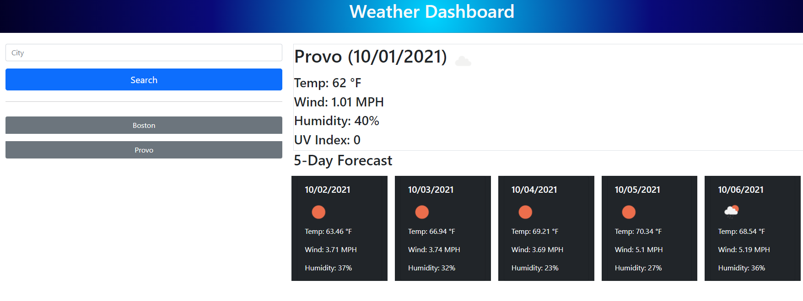

# weather-dashboard
## Description
- This website is designed to give end users information about the current and future weather forecast in any major city that they choose. All you have to do is type in the city you want, click on the search button, and your page will populate with the weather info. A button will also be generated below the search bar of your previous searches. 
-Unfortunately, I have yet to be able to get the dynamically generated buttons to work, however for now they do a good job in keeping track of which ones you have already searched. 

## Live Site: 
https://specsnstats.github.io/weather-dashboard/

## Repository: 
https://github.com/specsnstats/weather-dashboard

## Credits: 
Jonathan Newman with the help of my teacher, teachers assistants, and study group.